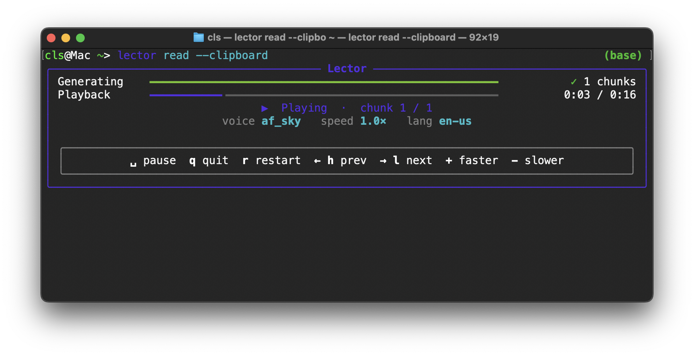

# Lector

**Read text aloud with high-quality neural TTS — from clipboard, stdin, or argument.**

> [!WARNING]
> Lector is in early development. Expect rough edges, breaking changes, and missing features.

Lector wraps [kokoro-onnx](https://github.com/thewh1teagle/kokoro-onnx) in a
simple CLI with an interactive player.  Audio is streamed chunk-by-chunk so
reading starts immediately, even for long texts.

<p align="center">
  
</p>

## Prerequisites

You need [uv](https://docs.astral.sh/uv/), a Python package manager.
It handles everything else (including Python itself) automatically.

**Install uv** — open **Terminal** (⌘ Space → type "Terminal" → Enter) and run:

```bash
curl -LsSf https://astral.sh/uv/install.sh | sh
```

Or via [Homebrew](https://brew.sh/):

```bash
brew install uv
```

Close and reopen Terminal so the `uv` command is available.

## Install

```bash
uv tool install git+https://github.com/clstaudt/lector
```

Or, if you have the source code locally:

```bash
uv tool install /path/to/lector
```

This installs `lector` as a system-wide command.  The first time you
use it, model files (~300 MB) are downloaded automatically to
`~/.lector/models/`.

## Usage

```bash
# Read text directly
lector read "The quick brown fox jumps over the lazy dog."

# Read from the clipboard
lector read --clipboard

# Pipe text in
pbpaste | lector read
cat article.txt | lector read
```

### Player controls

While audio is playing, use these keys:

| Key       | Action  |
| --------- | ------- |
| `Space`   | Pause / resume |
| `q`       | Quit    |
| `r`       | Restart |
| `← h`     | Previous chunk |
| `→ l`     | Next chunk |
| `+`       | Speed up  |
| `-`       | Slow down |

### Voices

```bash
lector voices
```

Popular English voices: `af_heart`, `af_nicole`, `af_sarah`, `af_sky`,
`am_michael`.  Pick one with `--voice`:

```bash
lector read --voice af_nicole --speed 0.9 "Hello!"
```

See the full list at
[Kokoro-82M/VOICES.md](https://huggingface.co/hexgrad/Kokoro-82M/blob/main/VOICES.md).

## macOS right-click integration

Add a **Quick Action** so *Read with Lector* appears in the right-click
Services menu — just like the built-in "Start Speaking":

```bash
lector install-service
```

Then:

1. Select text in any app.
2. Right-click → **Services** → **Read with Lector**.
3. (First time you may need to enable it in
   **System Settings → Keyboard → Keyboard Shortcuts → Services**.)

## Commands

| Command                | Description                               |
| ---------------------- | ----------------------------------------- |
| `lector read`          | Read text aloud (arg / clipboard / stdin) |
| `lector voices`        | List available voice names                |
| `lector download`      | Pre-download model files (~300 MB)        |
| `lector install-service` | Install macOS Quick Action              |

## Updating

```bash
uv tool upgrade lector
```

## Uninstall

```bash
uv tool uninstall lector
rm -rf ~/.lector   # remove downloaded models
```

## Development

```bash
git clone <repo-url> && cd lector
uv sync
uv run lector read "Hello!"
uv run pytest
```

## License

MIT
